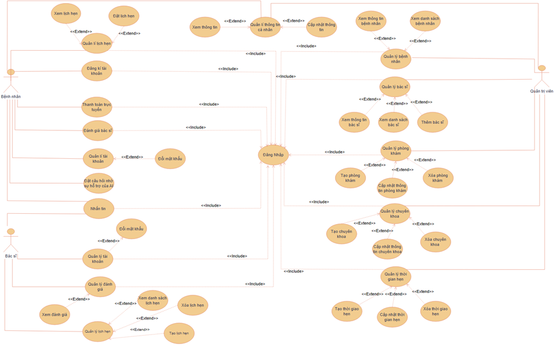
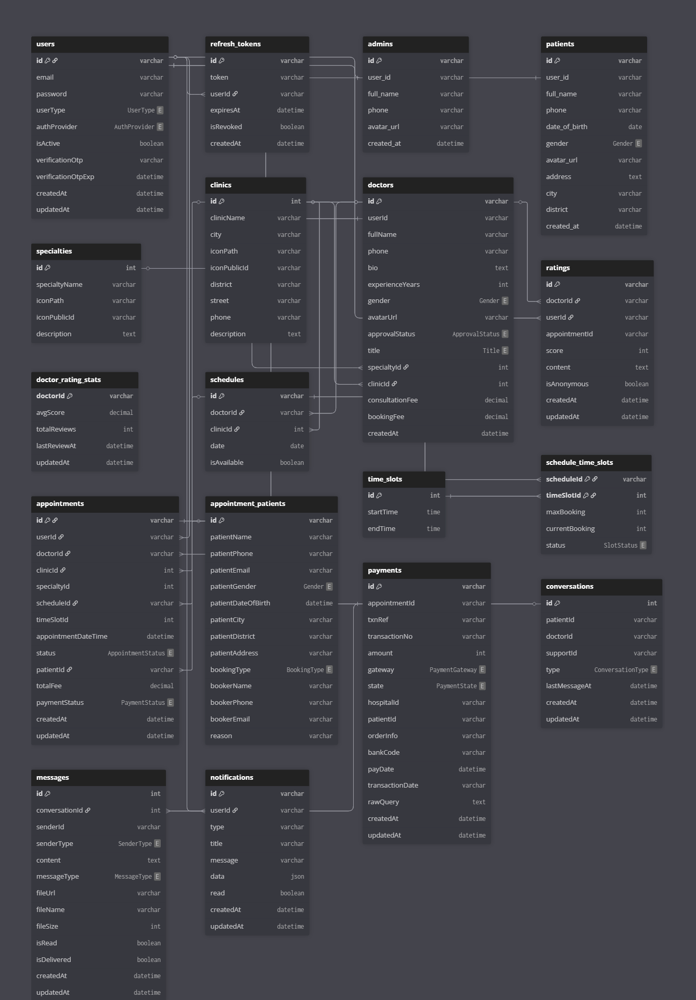

    
    <h1>MEDICARE</h1>
    <h3>🏥 Medicare - Ứng dụng đặt lịch khám và quản lý sức khỏe thông minh 🏥</h3>
	

		<a href="#gioi-thieu">📘 Giới Thiệu</a> -
		<a href="#cong-nghe-su-dung">📚 Công nghệ sử dụng</a> -
		<a href="#so-do-he-thong">📑 Sơ đồ hệ thống</a> -
		<a href="#so-do-use-case">✏️ Sơ đồ Use Case</a> -
		<a href="#so-do-database">📂 Sơ đồ database</a> -
		<a href="#kien-truc-phan-mem">📐 Kiến trúc phần mềm</a> - 
		<a href="#hiện-thực">📺 Hiện Thực</a> -
		<a href="#thành-viên-thực-hiện">👪 Thành viên thực hiện</a>
	

<h2>
📘 Giới thiệu
</h2>

MEDICARE là hệ thống web hỗ trợ đặt lịch khám bệnh trực tuyến, quản lý bác sĩ, bệnh nhân, lịch làm việc và thanh toán online. Ứng dụng hướng tới việc số hóa quy trình khám chữa bệnh, giảm tải cho bệnh viện và nâng cao trải nghiệm người dùng.

Đối tượng sử dụng:

👨‍⚕️ Bác sĩ: quản lý lịch khám, nhắn tin bệnh nhân , xem đánh giá , nhận thông báo

🧑‍🤝‍🧑 Bệnh nhân: đặt lịch, thanh toán, nhận thông báo , nhắn tin bác sĩ

🛠 Admin: quản lý hệ thống, doanh thu, tài khoản

<h2>
📚 Công nghệ sử dụng
</h2>
<h4><b>Frontend</b></h4>

⚛️ ReactJS

🎨 Ant Design

🔌 Socket.io (Realtime)

<h4><b>Backend</b></h4>

🟢 Node.js + Express

🧩 Microservices Architecture

🔐 JWT Authentication

📨 RabbitMQ (Message Queue)

<h4><b>Database</b></h4>

🐬 MySQL (User, Appointment, Payment,...)

🔷 Prisma ORM

<h4><b>DevOps</b></h4>

🐳 Docker & Docker Compose

<h2>
📑 Sơ đồ hệ thống
</h2>

<h3><b>🔹Use Case Diagram</b></h3>

<h3><b>🔹Database Schema Diagram</b></h3>

<h2>
📑 Kiến trúc phần mềm
</h2>

